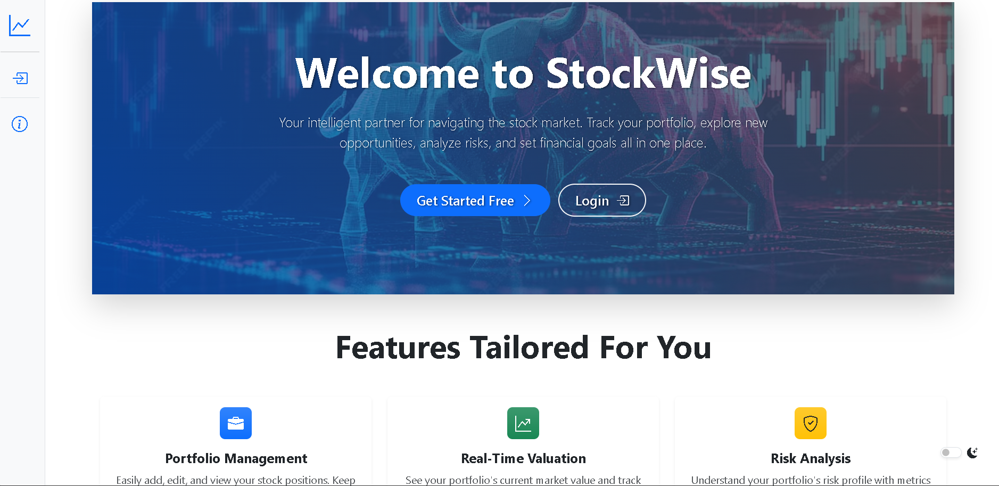
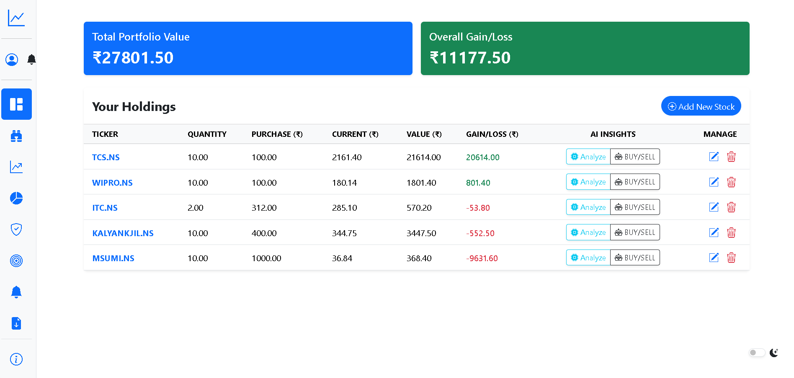
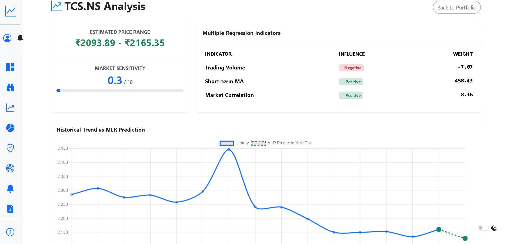
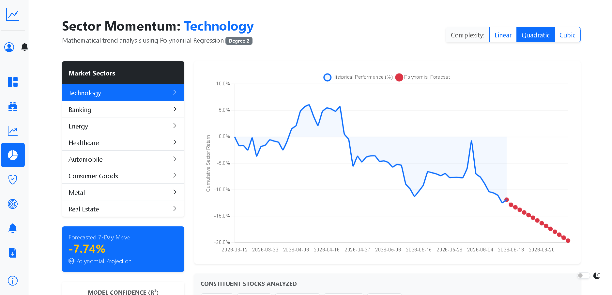
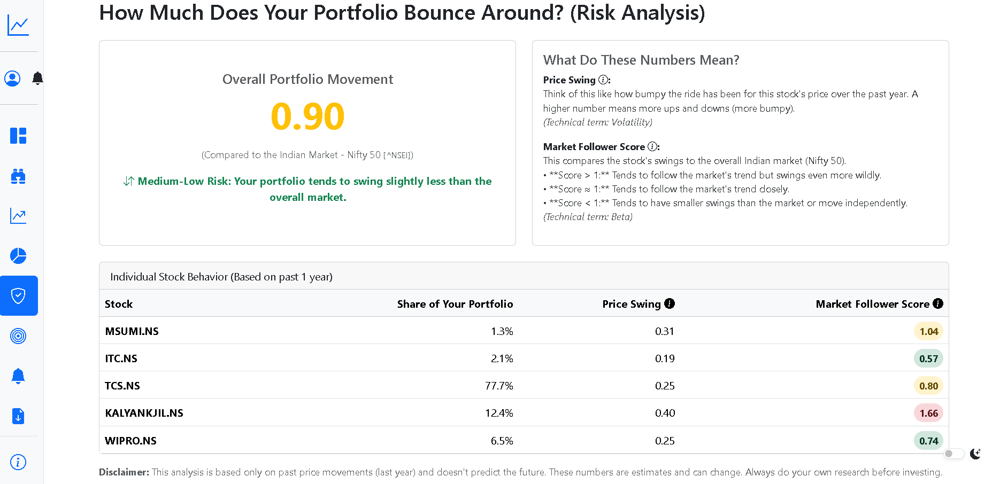
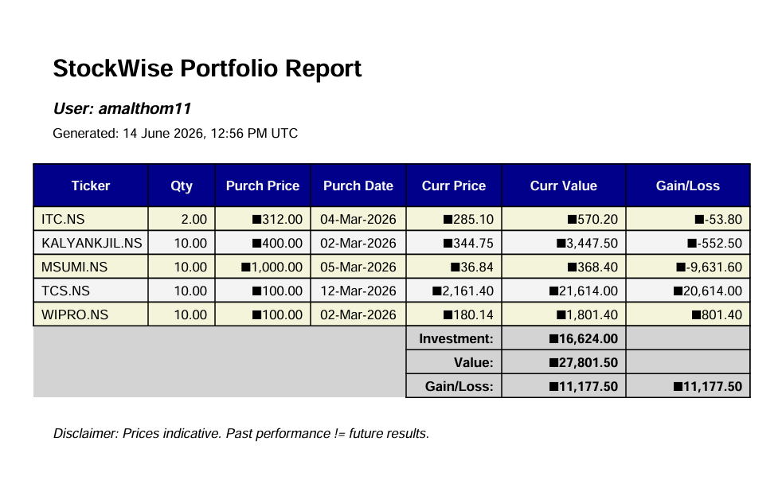

# 📈 StockWise — Portfolio Tracker & ML Analytics Engine

A modern, responsive, and intelligence-driven Django application for managing stock portfolios, analyzing risks, tracking financial goals, and running predictive analytics using Machine Learning.

---

## 🚀 Key Features

### 📊 Portfolio Dashboard & Management
* **Real-time Price Syncing**: Automatically fetches stock data from Yahoo Finance (`yfinance`).
* **Active Positions Details**: Track quantities, purchase price, current price, total investment, current valuation, and net gain/loss.
* **Auto-completion Search**: Search stock symbols using the Alpha Vantage API with built-in translations for US and Indian exchanges (`.NS`, `.BO`).
* **Export Reports**: Generate and download professional CSV or PDF reports (using ReportLab) of current holdings.

### 🧠 Intelligent Predictive Analytics (Machine Learning)
* **7-Day Trend Forecast**: Leverages **Linear Regression** on historical stock prices to forecast future trends. Includes calculated $R^2$ model accuracy.
* **Multiple Linear Regression (MLR)**: Features standard scaling (`StandardScaler`) and multi-factor regression using trading volume, short-term moving averages (MA5, MA10), market index correlation (e.g., NIFTY/SENSEX), and rolling volatility.
* **K-Nearest Neighbors (KNN) Classifier**: Evaluates 5 years of historical returns, volatility, momentum, and volume to categorize stocks into Buy, Hold, or Sell signals with neighbors-based confidence scoring.
* **Sector Analysis**: Normalizes prices to index bases and applies **Polynomial Regression** (up to degree 2 or user-defined) over sectors like Technology, Energy, Banking, and Auto to map macro sector trends.

### 🛡️ Risk Assessment & Financial Goal Tracker
* **Risk Engine**: Computes standard deviations (annualized volatility), covariance, and beta ratios relative to benchmark indices (`^NSEI` or `^GSPC`).
* **Goal Setting**: Track specific savings goals, tie them to overall portfolio value or individual stock assets, and track progress with interactive bars.
* **Custom Alert Thresholds**: Create thresholds for high beta or extreme volatility, generating internal user alerts and notifications.

### 🎨 Premium UI/UX Design
* **Adaptive Light/Dark Themes**: Modern aesthetics with a toggle that persists user choices via `localStorage`.
* **Collapsible Dynamic Sidebar**: Fits desktop viewports with responsive off-canvas menus for smaller devices.
* **High-performance Charting**: Renders interactive price histories via Apache ECharts and predictive timelines using Chart.js.

---

## 🛠️ Technology Stack

| Layer | Technology | Description |
| :--- | :--- | :--- |
| **Backend Framework** | Django (Python) | Core MVC routing, views, models, and session administration. |
| **Database** | SQLite3 | Default lightweight database for structured storage. |
| **Machine Learning** | `scikit-learn` | Standard Scaling, Linear Regression, KNN Classification. |
| **Data Engineering** | `pandas`, `numpy` | Data structures, matrix normalization, rolling windows, covariance. |
| **APIs / Data Feeds** | `yfinance`, Alpha Vantage | Financial datasets and active stock symbol indexes. |
| **PDF Processing** | ReportLab | Programmatic PDF invoice/report construction. |
| **Frontend** | Bootstrap 5, Vanilla CSS3 | Grid layouts, theme support, responsiveness, and components. |
| **Visual Charts** | Apache ECharts, Chart.js | Canvas/SVG renderings of stock tickers and ML predictions. |

---

## 📁 Repository Structure

```text
stockwise/
├── config/                 # Django main project configuration
│   ├── settings.py         # Config variables, apps, DB and security profiles
│   ├── urls.py             # Root URL redirects
│   └── wsgi.py / asgi.py   # Gateway Server interfaces
├── portfolio/              # Main application logic
│   ├── ml/
│   │   └── predictor.py    # Basic linear regression utilities
│   ├── templates/          # HTML templates for user interfaces
│   ├── api_service.py      # yfinance and Alpha Vantage fetch wrappers
│   ├── forms.py            # Security-filtered input validation forms
│   ├── ml_engine.py        # Trend prediction algorithms
│   ├── models.py           # DB Schemas: Stock, Goal, Alerts, Notifications
│   ├── views.py            # Main controller logic, calculations, ML training
│   └── urls.py             # Route handlers for features
├── db.sqlite3              # Database
├── ec2_setup.sh            # Production shell setup for Ubuntu/Debian hosts
├── amazon_linux_setup.sh   # Production shell setup for RHEL/Amazon Linux hosts
├── requirements.txt        # Python dependency manifest
└── manage.py               # Django utility script
```

---

## ⚙️ Local Installation & Setup

Follow these steps to set up the project on your local machine:

### 1. Prerequisites
Ensure you have **Python 3.8+** installed on your system.

### 2. Clone the Repository
```bash
git clone <repository-url>
cd stockwise1
```

### 3. Create and Activate a Virtual Environment
**Windows:**
```powershell
python -m venv venv
venv\Scripts\activate
```

**macOS/Linux:**
```bash
python3 -m venv venv
source venv/bin/activate
```

### 4. Install Dependencies
```bash
pip install -r requirements.txt
```

### 5. Setup Environment Variables
Create a file named `.env` in the project root directory:
```env
ALPHA_VANTAGE_API_KEY=BR2XTY29A0YCY767
# Optional: Django Secret Key or Email configuration
# DJANGO_SECRET_KEY=custom-production-key
```

### 6. Perform Database Migrations
Initialize the SQLite database and create schemas:
```bash
python manage.py migrate
```

### 7. Run the Development Server
```bash
python manage.py runserver
```
Navigate to `http://127.0.0.1:8000` in your web browser.

---

## 🌐 Production Deployment

The project includes two automated scripts to configure **Gunicorn** and **Nginx** reverse proxies on cloud servers:

### Ubuntu / Debian (EC2)
Review [ec2_setup.sh](file:///e:/f/stockwise1/ec2_setup.sh):
```bash
chmod +x ec2_setup.sh
./ec2_setup.sh
```

### Amazon Linux 2023 / CentOS
Review [amazon_linux_setup.sh](file:///e:/f/stockwise1/amazon_linux_setup.sh):
```bash
chmod +x amazon_linux_setup.sh
./amazon_linux_setup.sh
```

## Screenshots
### Home Screen

### User dashboard

### Stock Analysis & Prediction

### Sector Analysis

### Risk Analysis

### Portfolio Report


These scripts automate system package installations, set up the virtual environment, compile assets, generate Gunicorn systemd configurations, and hook Nginx up to serve static assets and proxy web traffic.

---

## ⚠️ Disclaimer
Investing in stock markets involves high risk. StockWise predictions are generated via standard machine learning techniques and are designed strictly for **educational and demonstration purposes**. They do not constitute financial advice.
